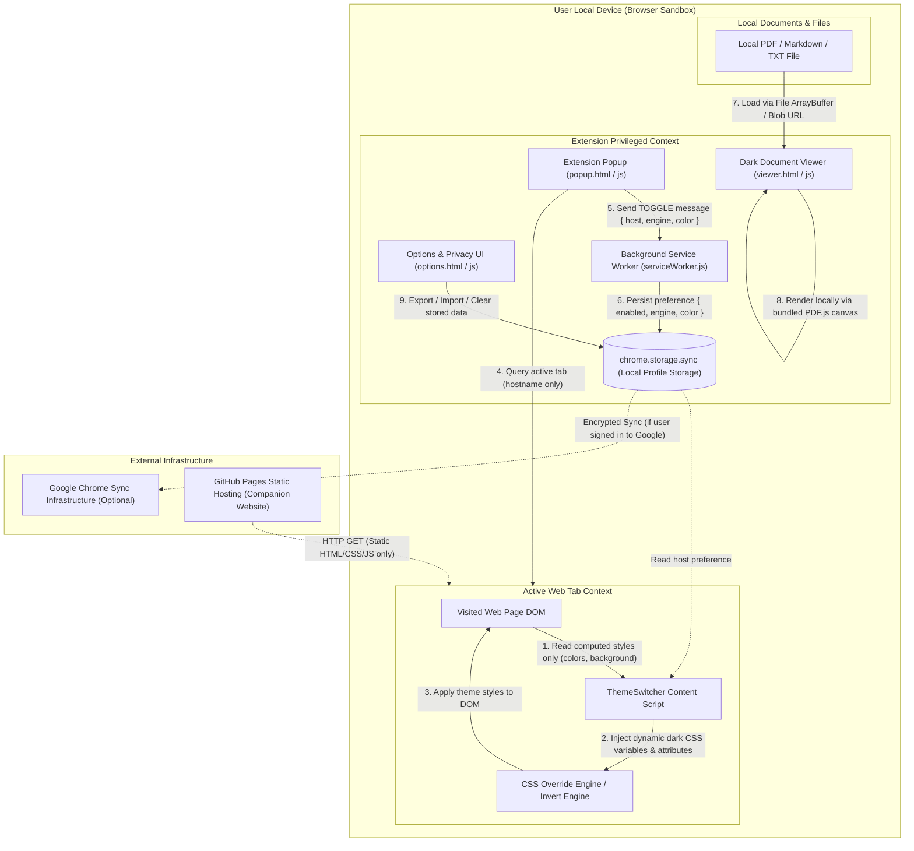

# ThemeSwitcher Data Flow Map

This document maps all architectural boundaries and data flows within the ThemeSwitcher browser extension and companion website.

---

## 1. Architectural Boundary Map

---

## 2. Granular Data Flow Analysis

### Flow 1: Web Page Recoloring (Content Script)
- **Source:** Web Page DOM computed styles (`getComputedStyle`).
- **Data Extracted:** Background color, text color, element dimensions, image/svg tag types.
- **Data Not Extracted:** Text content, form input, cookies, tokens.
- **Destination:** In-memory algorithm inside the tab's isolated world.
- **Egress:** **Zero.** Nothing leaves the tab.

### Flow 2: Extension Popup & Preference Toggle
- **Source:** User clicks extension action icon.
- **Data Extracted:** Active tab URL -> parsed to extract hostname only (`location.hostname`).
- **Data Minimization:** No path or query parameters are transmitted.
- **Message Transmitted:** `{ type: "TOGGLE", host: "example.com", engine: "css", backgroundColor: "#0f1115" }`.
- **Destination:** Background Service Worker -> `chrome.storage.sync`.
- **Egress:** **Zero.** Internal Chrome runtime message passing only.

### Flow 3: Dark Document Viewer
- **Source:** Local user-selected file or document URL.
- **Processing:** Client-side ArrayBuffer read -> Rendered to `<canvas>` via bundled `pdf.min.mjs` and `pdf.worker.min.mjs`.
- **Sandbox Isolation:** Fallback iframe runs with `sandbox="allow-scripts"` and `referrerpolicy="no-referrer"`.
- **Egress:** **Zero.** Documents never leave the user's browser.

### Flow 4: Companion Website
- **Source:** Browser navigation to `https://darkmode.pshah.fun`.
- **Delivery:** Static GitHub Pages CDN delivery over HTTPS.
- **Egress:** **Zero.** Zero analytics scripts, zero external counter APIs, zero third-party font or tracking pixels.
